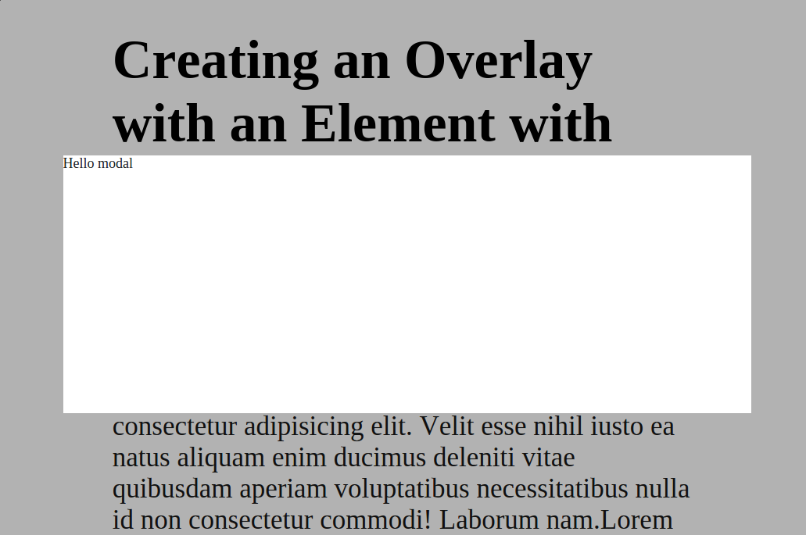

# dom-modal [](https://david-dm.org/vvo/dom-modal) [](https://david-dm.org/vvo/dom-modal#info=devDependencies)

Standalone modal for the browser.

- easy to style
- with overlay
- overlay click = close modal
- all-in-one JavaScript file
- ~2.5kb minified gzipped
- should work™ on IE9+



```shell
npm install dom-modal --save
```

# usage

```js
var modal = require('dom-modal');
var content = document.createElement('div');
content.innerHTML = "Hello modal";

var myModal = modal(content);

myModal.show();
myModal.hide();

myModal.on('show', console.log);
myModal.on('hide', console.log);
```

# test

```
npm test
```

# example

```
npm run example
```

Then open http://0.0.0.0:8080/example.html in a browser.

# styling

See the css files: [overlay.css](overlay.css), [modal.css](modal.css).

Just overwrite the styles you want.

# build

```shell
npm run build
```

# credits

CSS technique by [Sara Soueidan](https://twitter.com/SaraSoueidan) for http://tympanus.net/codrops/2013/11/07/css-overlay-techniques/.